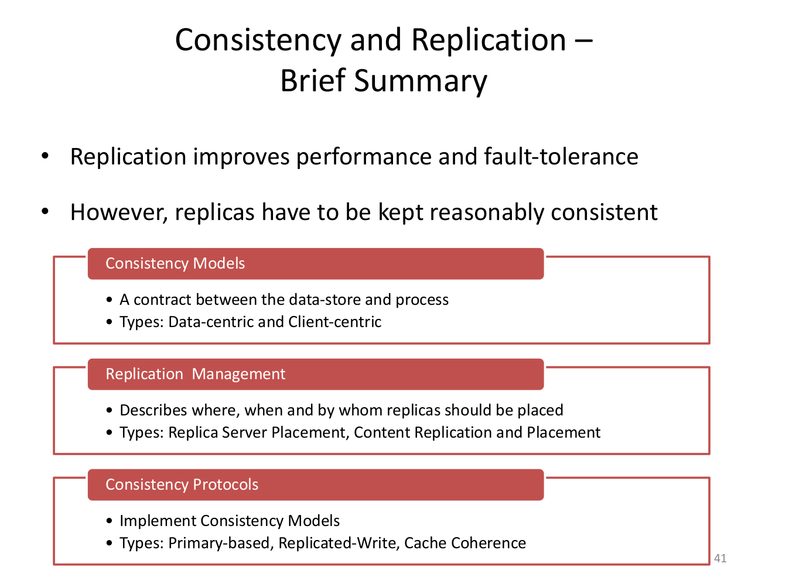

# Asynchronous Distributes Training

## POC

We are to design distributed asynchronous training algorithm of DNN model where hardware is of PC grade with standard network cards of 1GB/s bandwidth.

Hardware
1. GPU: 6 GB of memory
2. CPU: 8 cores
3. Network 1GB/s (low bandwidth) 
4. Star topology


Characteristic of training:
- Same model on all nodes
- Different initial parameters

#### Common characteristics dictated by hardware:
- Each node is fully optimised like for single node training 
- Nodes exchange gradients on low network speed. Gradients are send each k-iteration and received each (k+d)-itertion, where d is delay.
- Necessary hardware utilisation is scheduled to be reserved for network traffic.
- Star topology of network require sending data to "switch node", this switch may become master for gathering and broadcasting data. This data has to pass by this node anyway.


### Assumptions

1. Training is parallel with/without preemption. Preemption gives possibility to discarding too bad scored parameters and replacing with best ones.
2. Consistency is loose, in terms of parameters score. 
3. Sending/receiving all/best/better gradients.


### Review of DSys


    


###

### 12 Consistency and replication (3)




### MPI Non-blocking Snippet for Isend, Imrecv

```c
void mpi_nonblocking_ring(int argc, char *argv[]) {

	MPI_Init(&argc, &argv);
	int rank, nproc;
	MPI_Comm_rank(MPI_COMM_WORLD, &rank);
	MPI_Comm_size(MPI_COMM_WORLD, &nproc);

	constexpr size_t N = (size_t) 1e8;

	auto value = make_arr<int, N + 4>();

	std::fill(std::begin(value) + 2, std::end(value) - 2, rank + 1);
	int checksum = std::accumulate(std::begin(value) + 2, std::end(value) - 2, int{0});

	value[0] = BEGIN_E;
	value[1] = checksum;
	value[N + 3 - 1] = checksum;
	value[N + 4 - 1] = END_E;

	int next = (rank + 1) % nproc;
	int prev = (rank + nproc - 1) % nproc;
	MPI_Request sreq;
	MPI_Isend(&value[0], value.size(), MPI_INT, next, TAG_REQUEST_E, MPI_COMM_WORLD, &sreq);
	int fprobe = 0;
	int ftest = 0;
	MPI_Message msg;
	MPI_Status stest, sprobe;
	do {
		if (!ftest) {
			MPI_Test(&sreq, &ftest, &stest);
			if (ftest) {
				printf("Isend : [ %i<%i> >>> %i ]\n", rank, TAG_REQUEST_E, next);
			} else {
				printf("Test  : [ %i<%i> --> %i ]\n", rank, TAG_REQUEST_E, next);
			}
		}
		if (!fprobe) {
			int err = MPI_Improbe(prev, TAG_REQUEST_E, MPI_COMM_WORLD, &fprobe, &msg, &sprobe);
			if (fprobe) {
				auto input = make_arr<int, N + 4>();
				MPI_Imrecv(&input[0], input.size(), MPI_INT, &msg, &sreq);
				printf("Irecv : [ %i<%i> <<< %i ] : RCV input { PROBE[SRC:%i, TAG:%i, ERR:%i], DATA[ %i | %i | %i | %i ] }\n",
				       rank, TAG_REQUEST_E, prev, sprobe.MPI_SOURCE, sprobe.MPI_TAG, sprobe.MPI_ERROR,
				       input[0], input[1], input[N + 3 - 1], input[N + 4 - 1]);
			} else {
				printf("Probe : [ %i<%i> <-- %i ]\n", rank, TAG_REQUEST_E, prev);
			}
		}
	} while (fprobe == 0 || ftest == 0);
	MPI_Finalize();
}

```

### MPI Non-blocking all to all

```c
void test_isend_request(MPI_Request &sreq, int &ftests, MPI_Status &stest, int rank, int target) {

	int ftest = 0;
	MPI_Request_get_status(sreq, &ftest, &stest);
	if (ftest) {
		ftests += 1;
		printf(">>> : [ %i/%i ] : SND data { TEST[SRC:%i, TAG:%i, ERR:%i] }\n",
		       rank, target, stest.MPI_SOURCE, stest.MPI_TAG, stest.MPI_ERROR);
	} else {
		//printf("Test  : [ %i<%i> --> %i ]\n", rank, TAG_REQUEST_E, target);
	}

}

int probe_irecv_request(MPI_Request &sreq, int &fprobes, MPI_Status &sprobe, MPI_Message &msg, int rank, int sender) {

	int fprobe = 0;

	int err = MPI_Improbe(sender, TAG_REQUEST_E, MPI_COMM_WORLD, &fprobe, &msg, &sprobe);
	if (fprobe) {
		fprobes += 1;

	} else {
		//printf("Probe : [ %i<%i> <-- %i ]\n", rank, TAG_REQUEST_E, sender);
	}

	return fprobe;
}

template<typename T, size_t N>
int irecv_request(MPI_Request &sreq, MPI_Status &sprobe, MPI_Message &msg, int rank) {

	auto input = make_arr<T, N + 4>();
	MPI_Imrecv(&input[0], input.size(), MPI_INT, &msg, &sreq);
	printf("<<< : [ %i/%i ] : RCV data { PROBE[SRC:%i, TAG:%i, ERR:%i], DATA[ %i | %i | %i | %i ] }\n",
	       rank, sprobe.MPI_SOURCE, sprobe.MPI_SOURCE, sprobe.MPI_TAG, sprobe.MPI_ERROR,
	       input[0], input[1], input[N + 3 - 1], input[N + 4 - 1]);
}


void mpi_nonblocking_all_to_all(int argc, char *argv[]) {

	MPI_Init(&argc, &argv);
	int rank, nproc;
	MPI_Comm_rank(MPI_COMM_WORLD, &rank);
	MPI_Comm_size(MPI_COMM_WORLD, &nproc);

	constexpr size_t N = (size_t) 1e8;

	std::cout << "size [MB] : " << sizeof(int)*N/(1024*1024) << std::endl;

	auto value = make_arr<int, N + 4>();

	std::fill(std::begin(value) + 2, std::end(value) - 2, rank + 1);
	int checksum = std::accumulate(std::begin(value) + 2, std::end(value) - 2, int{0});

	value[0] = BEGIN_E;
	value[1] = checksum;
	value[N + 3 - 1] = checksum;
	value[N + 4 - 1] = END_E;
	
	MPI_Request sreq[32]{};
	for (int proc = 0; proc < nproc; proc++) {
		MPI_Isend(&value[0], value.size(), MPI_INT, proc, TAG_REQUEST_E, MPI_COMM_WORLD, &sreq[proc]);
	}

	int fprobe = 0;
	int fprobes = 0;
	int ftests = 0;

	MPI_Message msg;
	MPI_Status stest, sprobe;
	do {
		if (ftests < nproc) {
			for (int i = 0; i < nproc; i++) {
				test_isend_request(sreq[i], ftests, stest, rank, i);
			}
		}

		if (fprobes < nproc) {
			for (int i = 0; i < nproc; i++) {
				fprobe = probe_irecv_request(sreq[i], fprobes, sprobe, msg, rank, i);
				if (fprobe) {
					irecv_request<int, N>(sreq[i], sprobe, msg, rank);
				}
			}
		}
	} while (fprobes < 2 || ftests < 2);

	MPI_Finalize();

}

```